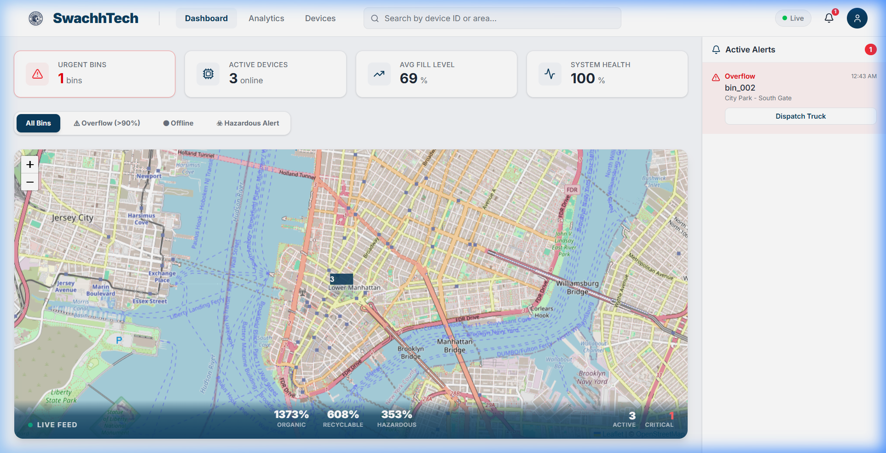

# SwachhTech - Smart Waste Management System

## Overview
SwachhTech is a comprehensive IoT-based platform designed for real-time monitoring and optimized management of smart waste bins. It provides a data-driven approach to waste collection, reducing operational costs and carbon footprints through precision logistics.

- **Problem it solves:** Eliminates inefficient, schedule-based waste collection route by providing real-time fill levels and AI-powered waste classification.
- **Target users:** Municipalities, smart city operators, and large-scale facility managers.

## Demo
- **Local Access:** [http://localhost:3000](http://localhost:3000)

- **Command Center View:**


## Features
- **Real-Time IoT Monitoring:** Continuous telemetry ingestion from smart bins via MQTT protocol.
- **AI-Powered Analysis:** Automatic classification of waste types (Organic, Recyclable, Hazardous) with confidence scoring.
- **Command Center Dashboard:** High-height interactive map with live status overlays and priority alert markers.
- **Priority Alerts:** Automated notification system for overflow (90%+ fill), low battery, or offline status.
- **Scalable Infrastructure:** Fully containerized microservices architecture for easy deployment and vertical/horizontal scaling.

## Tech Stack
- **Frontend:** Next.js 15+, React 19, Tailwind CSS 4, Recharts, Leaflet
- **Backend:** FastAPI (Python 3.9), SQLAlchemy (ORM), Paho-MQTT
- **Database:** PostgreSQL 15 (Relational storage with ACID compliance)
- **DevOps / Cloud:** Docker, Docker Compose
- **Communication:** MQTT (HiveMQ Public Broker / HiveMQ Cloud)

## System Architecture
The system follows a decoupled, event-driven architecture designed for high throughput and low-latency updates:

1. **IoT Tier:** Sensors (or Simulator) publish JSON telemetry payloads to an MQTT broker.
2. **Ingestion Tier:** The Backend subscribes to the MQTT broker, validates incoming data using Pydantic, and persists it to PostgreSQL.
3. **API Tier:** FastAPI provides RESTful endpoints for the dashboard to query aggregate metrics and device states.
4. **Presentation Tier:** Next.js dashboard uses SWR for real-time polling and dynamic re-rendering of the Command Center.

## Design Decisions
- **FastAPI:** Chosen for its native asynchronous support, which is critical for handling concurrent MQTT streams and high-frequency API requests.
- **PostgreSQL:** Provides a robust foundation for complex analytical queries and ensures data integrity for audit logs.
- **Docker Compose:** Used to ensure environment parity across the entire stack (DB, Backend, Frontend, Simulator) with a single `up` command.
- **Public MQTT Broker:** Bypasses authentication complexities for POC development while maintaining the logic to support private cloud clusters for production.

## Folder Structure
```text
.
├── backend/            # FastAPI source, models, and MQTT ingestion logic
├── frontend/           # Next.js 15 dashboard and UI components
├── simulator/          # IoT device simulation scripts (Python)
├── database/           # DB initialization and schema (sql)
├── docker-compose.yml  # Full-stack orchestration
├── .env                # Environment variables (excluded from git)
└── README.md           # Project documentation
```
